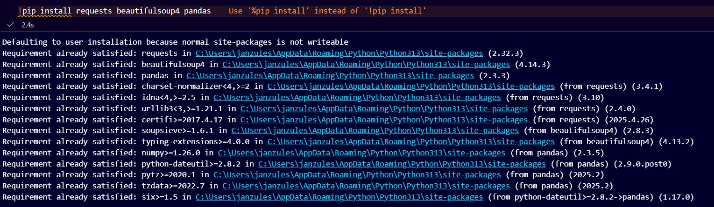
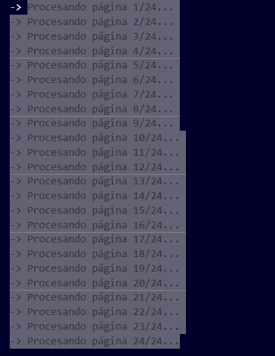
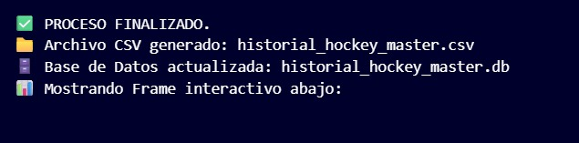
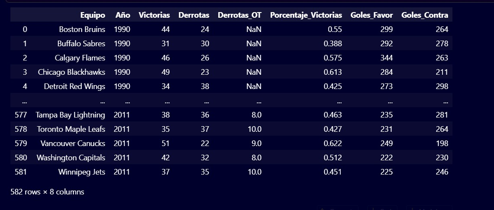
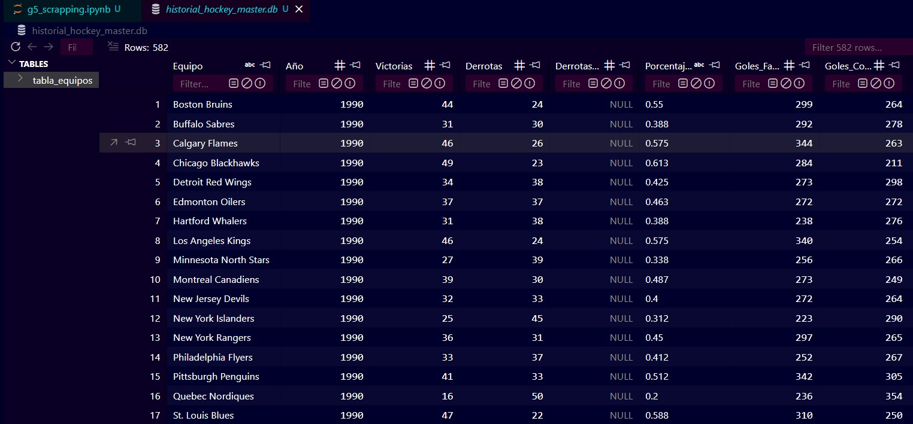

# g5-scrapping
Practica 2 Tratamiento de datos

# Web Scrapping: Historial de Equipos de Hockey 🏒

Este proyecto automatiza la extracción de datos históricos de equipos de hockey desde la web. El proceso incluye la navegación por múltiples páginas, la limpieza de datos con **Pandas** y el almacenamiento de la información tanto en formato plano (**CSV**) como en una base de datos relacional (**SQLite**).

## 📌 Descripción del Proyecto

El objetivo es consolidar estadísticas de rendimiento de diversos equipos (victorias, derrotas, goles a favor y en contra) a lo largo de diferentes años. Este proyecto forma parte de las actividades de procesamiento de datos del **Grupo 5**.

## 📸 Capturas de Ejecución

Para que el proyecto funcione correctamente, asegúrate de que las capturas estén en la carpeta `imagenes/`.










 


Proceso de scrapping y generación de DataFrames en el entorno de desarrollo.*

Estructura final de los datos procesados.*

## 📂 Estructura de Archivos

* `g5_scrapping.ipynb`: Notebook de Jupyter con la lógica de extracción (Scrapping), transformación (ETL) y carga de datos.
* `historial_hockey_master.csv`: Archivo de salida con los datos limpios listo para análisis en Excel o Power BI.
* `historial_hockey_master.db`: Base de datos SQLite que contiene la tabla con todo el histórico extraído.
* Se agrega recursos visuales para la documentación.

## 🛠️ Tecnologías Utilizadas

* **Python 3.13**: Lenguaje base del proyecto.
* **Pandas**: Biblioteca principal para la manipulación y estructuración de datos en DataFrames.
* **BeautifulSoup4 / Requests**: Herramientas para el análisis de HTML y peticiones web.
* **SQLite3**: Motor de base de datos ligero para el almacenamiento persistente.
* **Visual Studio Code**: Entorno de desarrollo (IDE) utilizado.

## 🚀 Cómo Empezar

1.  **Clonar el repositorio:**
    ```bash
    git clone [https://github.com/tecnojimbo/g5-scrapping.git](https://github.com/tecnojimbo/g5-scrapping.git)
    ```
2.  **Instalar las dependencias necesarias:**
    ```bash
    pip install pandas beautifulsoup4 requests
    ```
3.  **Ejecutar el Notebook:**
    Abre `g5_scrapping.ipynb` y ejecuta las celdas en orden para realizar una nueva extracción de datos.

## 👥 Autores - Grupo 5

* **Sixto Encalada** (Sencalada)
* **Yordhan Guerrón** (Yguerron)
* **Jimmy Anzules** (Janzules)

---
Proyecto desarrollado para la gestión y tratamiento de datos técnicos.

